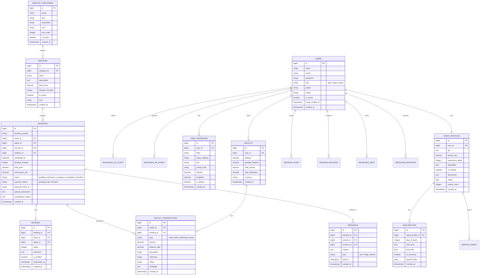

# Modèle Conceptuel de Données (MCD) - VIMAIZ

Voici la structure actuelle de la base de données de l'application VIMAIZ.

## Description des Entités

1.  **USERS** : Table centrale pour tous les utilisateurs (Clients, Agents, Admins).
2.  **AGENT_PROFILES** : Extension de la table Users pour les informations spécifiques aux agents (bio, tarif, expérience).
3.  **SERVICES & CATEGORIES** : Catalogue des services offerts (ex: Ménage standard, Nettoyage profond).
4.  **BOOKINGS** : Cœur du système, lie un Client, un Agent et un Service pour une date donnée.
5.  **WALLETS & TRANSACTIONS** : Système financier interne pour gérer les gains des agents et l'escrow.
6.  **USER_ADDRESSES** : Adresses des clients pour les interventions.
7.  **AVAILABILITIES** : Gestion des horaires de disponibilité des agents.
8.  **REVIEWS** : Système de notation et commentaires après prestation.
9.  **MESSAGES** : Communication interne entre Client et Agent liée à une réservation.
